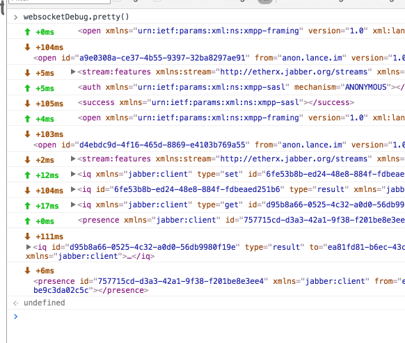

# websocket-debug

Chrome devtool's websocket frame debugger is kinda okay, but kinda sucks if you're doing xmpp as it won't reformat xml messages, and also has no ability to find/filter messages.

This is a (very basic) extension to start to make certain things easier.

**Note: this is a rough and ready extension, currently it will log all websocket messages on all domains (just into an array in memory) so, yeah, disable it when you don't need it (or make it better)**

## Installation

Clone repo and install as an unpacked chrome extension for now


## Usage

The extension modifies the WebSocket constructor to log incoming and outgoing messages into an array.

It exposes a `window.websocketDebug` module you can interact with on the console.


### Functions

See the [options](#options) section to understand the options that can be passed to most of these.

#### `websocketDebug.pretty(options)`

`websocketDebug.pretty()` pretty prints all the logs, like this:



#### `websocketDebug.logs(options)`

```javascript
// dump out all the logs
logs = websocketDebug.logs()

//logs:
[
    //socket_id, direction, time, msg
    [0, 'out', 1462445613069, 'an outgoing message'],
    [0, 'in', 1462445613070, 'an incoming message']
]
```

#### `websocketDebug.csv(options)`


```javascript
// dump out logs as csv, (useful for copying to the clipboard)
websocketDebug.csv()
//or
copy(websocketDebug.csv()) // to copy to clipboard

//logs
//nb: this could do with better formatting to handle commas/spaces in messages tbh
"0,out,1462445613069,an outgoing message
0,in,1462445613070,an incoming message"
```

#### `websocketDebug.clear()`

`websocketDebug.clear()` clears the currently seen logs from memory

#### `websocketDebug.sockets`

Each websocket that is given it's own id (for filtering out easily), use `websocketDebug.sockets` to see the socket urls and their ids.

```javascript
websocketDebug.sockets

{
    "http://myurl.com": 0,
    "https://otherurl.com": 1
}
```

#### `websocketDebug.defaultColumns`

See the default column list that will be returned in csv/log outputs

```javascript
websocketDebug.defaultColumns

['socket_id', 'direction', 'time', 'msg']
```

### Options

`log()`, `csv()` and `pretty()` all take the same options object. All options are optional. Here's an example showing all the options

```
websocketDebug.log({
    // columns and order to keep in each log
    // n.b. pretty() ignores this field
    columns: ['direction', 'msg'],

    // return the raw log object, instead of a columnified array
    // probably don't need to use this often, but pretty uses it
    // if set, columns is ignored
    raw: true,

    // number of logs (from most recent backwards) to return
    limit: 10,

    // an object of columns to filter results by
    filters: {
        // columns can be filtered to match a string:
        direction: 'in'

        // or to match a regex
        msg: /foo/,

        // or to match a function
        time: (time) => time < Date.now() - 10000,

        // you can invert matches like so
        // (n.b. in practice don't try and match and invert match the same columns)
        "!msg": /foo/, // matches logs with msg column not matching the regex
    },

    // disable pretty printing xml in `pretty()` calls
    // n.b. only matters for `pretty()`
    noxml: true
})
```
